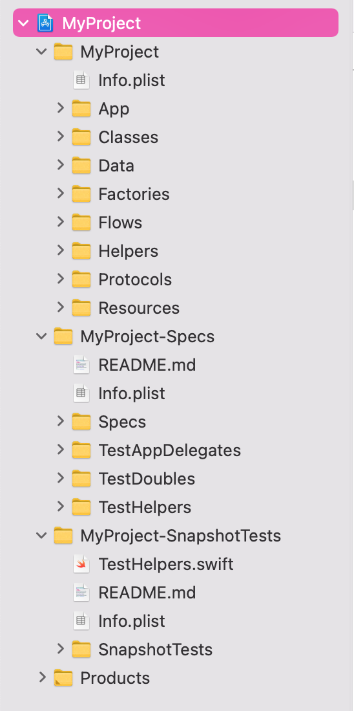

<!-- PROJECT BANNER -->
<br />
<p align="center">
  <a href="https://github.com/tw-space/CoordinatorStarter-XCodeProjectTemplate">
    
  </a>

  <h2 align="center">Coordinator Starter, an XCode Project Template for iOS</h3>

  <p align="center">
    Jumpstart your next iOS project with this starter XCode project template showcasing Coordinators.
    <br />
    Based on <a href="https://github.com/AndreyPanov">Andrey Panov</a>'s
    <a href="https://github.com/AndreyPanov/ApplicationCoordinator">ApplicationCoordinator</a> tutorial.
    <br />
    Includes full test coverage using <a href="https://github.com/Quick/Quick">Quick</a>
    & <a href="https://github.com/Quick/Nimble">Nimble</a>, and 
    <a href="https://github.com/pointfreeco/swift-snapshot-testing">swift-snapshot-testing</a>.
    <br />
  </p>
</p>


### Contents

1.  [tl;dr](#tldr)
2.  [About Coordinators](#about-coordinators)
3.  [Getting Started](#getting-started)
    -   [Prerequisites](#prerequisites)
    -   [Installation](#installation)
    -   [Uninstallation](#uninstallation)
4.  [Usage](#usage)
5.  [Screenshots](#screenshots)

<br />


## tl;dr

This is a ready-to-go XCode project template based on [AndreyPanov](https://github.com/AndreyPanov)'s [ApplicationCoordinator](https://github.com/AndreyPanov/ApplicationCoordinator) tutorial, and adds:

1.  Code-based views
2.  Persistence
3.  [Quick](https://github.com/Quick/Quick) & [Nimble](https://github.com/Quick/Nimble) specs with 87%+ code coverage 
4.  [Swift-snapshot-testing](https://github.com/pointfreeco/swift-snapshot-testing)

Just clone the repo, run `make install`, then start a new XCode project with the newly available **Coordinator Starter** Application template.


## About Coordinators

A lot has been written about Coordinators since the idea was introduced by [Khanlou in 2015](https://khanlou.com/2015/01/the-coordinator/). They're a piece of the ongoing puzzle of structuring iOS app code in a way that, for one, fixes the otherwise hard to escape problem of [massive view controllers](https://khanlou.com/2015/12/massive-view-controller/). Coordinators refactor out a major responsibility, navigation between view controllers, into its own files. 

[AndreyPanov](https://github.com/AndreyPanov)'s [ApplicationCoordinator](https://github.com/AndreyPanov/ApplicationCoordinator) example, the basis for this template and written for his tutorial write-ups *Coordinators Essential [Part I](https://medium.com/blacklane-engineering/coordinators-essential-tutorial-part-i-376c836e9ba7)* and *[Part II](https://medium.com/blacklane-engineering/coordinators-essential-tutorial-part-ii-b5ab3eb4a74)*, also includes a Router, which further refactors out the responsibility of pushing, popping, presenting, dismissing, etc., view controllers on a nav stack.

To learn more about Coordinators, and especially the ideas behind this template, consider reading the README and above tutorial posts from the [ApplicationCoordinator](https://github.com/AndreyPanov/ApplicationCoordinator) project, as well as:

1.  Khanlou's original [The Coordinator](http://khanlou.com/2015/01/the-coordinator/) and [Coordinators Redux](http://khanlou.com/2015/10/coordinators-redux/) posts, and his later series on [Advanced Coordinators](https://khanlou.com/tag/advanced-coordinators/).
2.  Paul Hudson's ([hackingwithswift.com](https://hackingwithswift.com) articles [How to use the coordinator pattern in iOS apps](https://www.hackingwithswift.com/articles/71/how-to-use-the-coordinator-pattern-in-ios-apps) and [Advanced coordinators in iOS](https://www.hackingwithswift.com/articles/175/advanced-coordinator-pattern-tutorial-ios).


## Getting Started

### Prerequisites

*   XCode (tested with 12.5)

### Installation

1.  Clone the repo
    ```sh
    git clone https://github.com/tw-space/CoordinatorStarter-XCodeProjectTemplate
    ```
2.  Run the Makefile
    ```sh
    make install
    ```
3.  Open XCode, create a new project, and choose the **Coordinator Starter**, newly listed under *Application* templates.


4.  Optionally choose to:
    -   [ ] Include Quick & Nimble specs
    -   [ ] Include Snapshot Tests

5.  (Optional) Set up [Quick](https://github.com/Quick/Quick) and [Nimble](https://github.com/Quick/Nimble):
    1.  *File* > *Swift Packages* > *Add Package Dependency...*
    2.  Enter in https://github.com/Quick/Quick, then click *Next*
    3.  Wait, then choose *Version: Up to Next Major*, then click *Next*
    4.  Wait, then for the Target, make sure to choose *PROJECTNAME-Specs*, then click *Finish*
    5.  Repeat step 1
    6.  Enter in https://github.com/Quick/Nimble, then click *Next*
    7.  Repeat step 3
    7.  Repeat step 4

6.  (Optional) Set up [swift-snapshot-testing](https://github.com/pointfreeco/swift-snapshot-testing)
    1.  *File* > *Swift Packages* > *Add Package Dependency...*
    2.  Enter in *either*:
        1.  https://github.com/tw-space/swift-snapshot-testing , which adds missing screen sizes
        2.  https://github.com/pointfreeco/swift-snapshot-testing , the original, which will be better maintained
    3.  Wait, then depending on step 2:
        1.  For the first URL, **make sure to choose *Branch: Main***, then click *Next*
        2.  For the second URL, choose *Version: Up to Next Major*, then click *Next*
    4.  Wait, then for the Target, make sure to choose *PROJECTNAME-SnapshotTests*, then click *Finish*

### Uninstallation

Run `make uninstall` in the cloned directory.


## Usage

Run the app, explore the project files, run the tests, run the snapshots (twice), and start coding!


## Screenshots

<p>
  
  
  
</p><p>
  
  
</p>